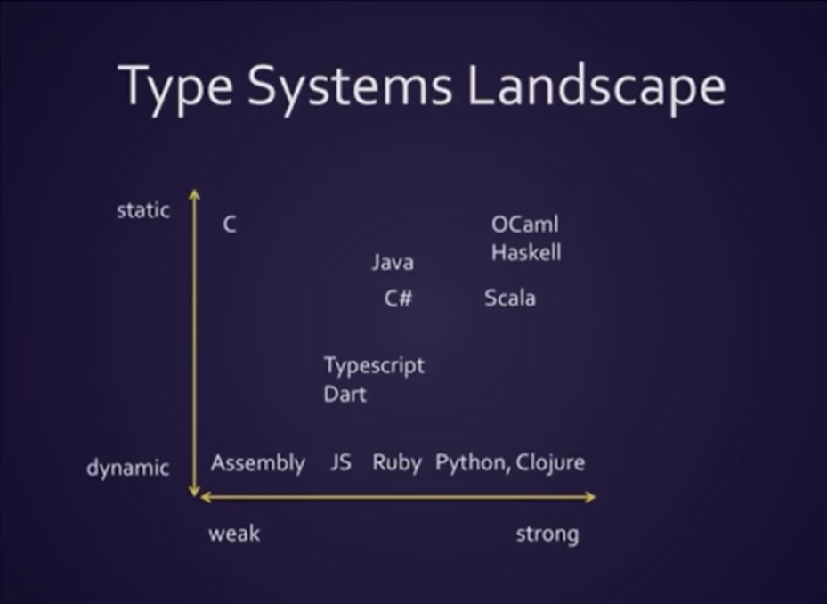
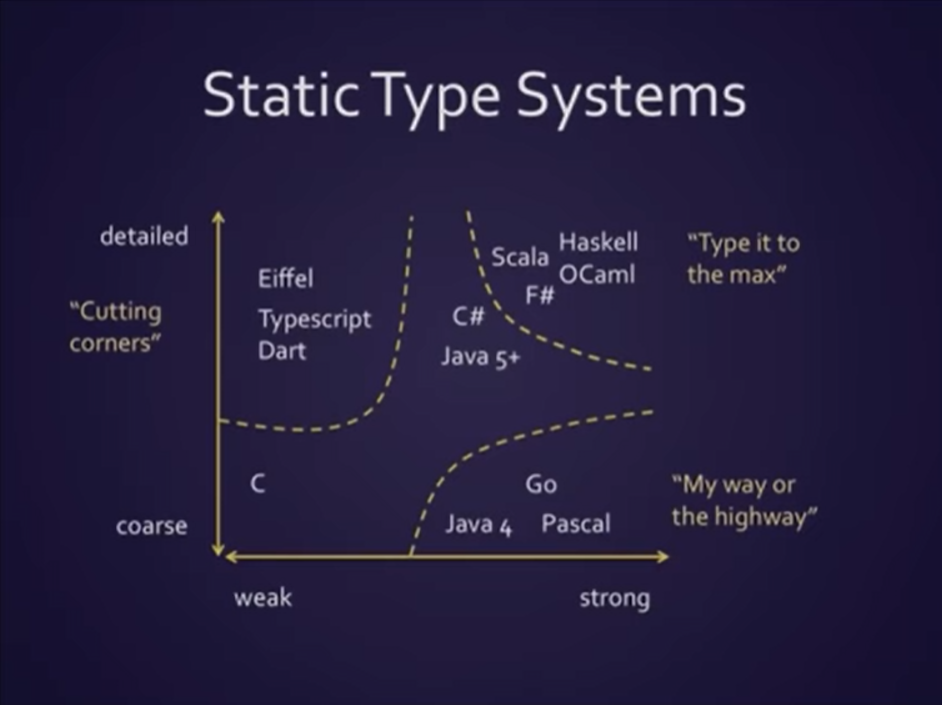
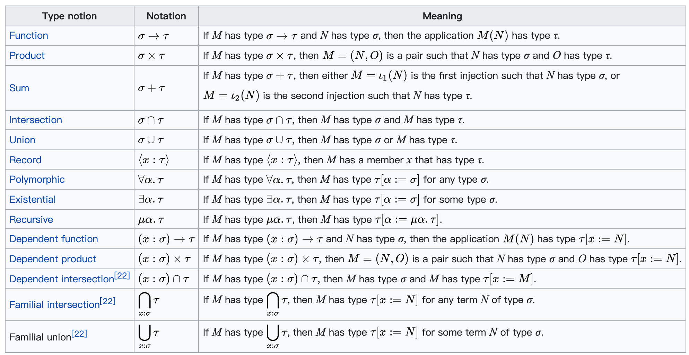

## 类型系统


类型是啥？从小被教导这是什么形状，进行分类…… 类型化……


## 类型由来

从历史上看，数学，逻辑学，集合论，类型论。

Bertrand Russell（罗素）& [ZFC](https://en.wikipedia.org/wiki/Zermelo%E2%80%93Fraenkel_set_theory)

- 每个术语都应该被分配一个类型。它通常用冒号表示：
2 : nat

- 如果我们想定义一个函数，我们将定义它操作的类型：例如
times2 : nat → nat

> f : X → Y read as: f is a function from X (domain) to Y (codomain).

- 可以使用明确定义的规则转换术语：例如
2 + 2 ↠ 4 和 2 + 2 = 4, 他们的类型是相同的

1940年，Alonzo Church将类型理论与他自己的`lambda`演算相结合，创建了[简单类型的lambda演算](https://en.wikipedia.org/wiki/Simply_typed_lambda_calculus)。从那时起，出现了更高级的类型理论。


## 直觉类型论

类型论与集合论并行存在：

1. 我们说值a属于一个类型A：`(a : A)`
2. 我们也可以说值a属于一个集合A：`(a ∈ A).`
3. 我们也可以说类型A是类型B的父类型，类型B是类型C的父类型：`C ⊂ B ⊂ A`
4. 我们也可以说t同时属于类型X和Y：`t ∈ X ∩ Y`

如果我们定义了一组除自身之外的所有值，在类型理论中，我们将其称为顶级类型：包含所有其他类型（是其超类型）的类型。类似地，空集将有一个底部类型形式的对应物。为了更容易记住，将类型想象成一个层次结构，其中更通用（较少限制）的类型在上面，更具体（有更多要求）在下面。然后没有要求的类型将位于顶部并包含所有值，而底部的类型及其上方所有类型的要求（必须是矛盾的）将是空的

> top type, bottom type


## In Programming Language

**划重点**

- 对于计算机 - 类型描述了如何解释内存中的位模式

- 对于编译器或解释器 - 类型有助于确保在程序运行时一致地解释位模式

- 对于程序员 - 用户体验

  

*类型系统其实就是，对类型进行定义、检查和处理的系统。*

作为一门语言的核心要素，类型系统很大程度上塑造了语言的用户体验以及程序的安全性。因为，在机器码的世界中，没有类型而言，指令仅仅和立即数或者内存打交道，内存中存放的数据都是字节流。

所以，可以说类型系统完全是一种工具，编译器在编译时对数据做静态检查，或者语言在运行时对数据做动态检查的时候，来保证某个操作处理的数据是开发者期望的数据类型。

*Type Systems Landscape*





- 强类型、弱类型：强调开发体验，定义后能否被隐式转换

- 静态类型、动态类型：强调在哪个期间做类型检查（编译期间/运行期间、编译器/解释器）

  

### Named Type/Nominal typing

就是直白的，基本的类型定义，例如class/interface/trait/object/enumeration

in scala

```scala
object Person {}
trait Service { def sleep = ??? }
```

in typescript

```typescript
class Person {}
interface Service { peaceful?: boolean; }
```


### Parameterized type

顾名思义：参数化类型，简单讲，它可以是泛型。

in scala

```scala
sealed abstract List[+A]
```

in java

```java
public <T> List<T> fromArrayToList(T[] a) {   
    return Arrays.stream(a).collect(Collectors.toList());
}
```

in rust

```rust
fn largest<T>(list: &[T]) -> T {}
```

in typescript

```typescript
function identity<Type>(arg: Type): Type {
  return arg;
}
```

泛型概念较多，型变、不变、协变、逆变; use-site、declaration-site等等，就不在这里具体展开了

具体语言实现方式各有千秋：静态分派，动态分派，类型擦除


### Dependent type

依赖类型通过使程序员能够分配进一步限制可能实现集的类型来帮助减少错误；简单讲，就是提升类型推导能力

in scala

```scala
class X {
  type Y = String
  val y: Y = "y"
}

val x1 = new X
val x2 = new X

def y(x: X)(y: x.Y): Unit = ()

y(x1)(x2.y) // no complaints: x1.Y = String = x2.Y

// 在Java中，编译是通过的
```


### Existential Type

存在的类型，其目的是提升抽象能力，更方便扩展，也是多在函数式编程语言常见，在OOP中有点像接口，但比接口更强大优雅

in haskell - 是一种将一组类型“压缩”为一个单一类型的方法

```haskell
{-# LANGUAGE ExistentialQuantification #-}

-- s. 就是type
data ShowBox = forall s. Show s => SB s
         
hList :: [ShowBox]
hList = [SB "a", SB (), SB 5, SB True]

instance Show ShowBox where
    show (SB s) = show s
    
f :: [ShowBox] -> IO ()
f xs = mapM_ print xs

main = f hList

{- print
"a"
()
5
True
-}
```

in scala

```scala
// scala 2.13.x
List[T] forSome { type T }

// Dotty(scala 3) dropped Existential type
```


### Union/Intersection Type

集合论：A ∩ B = {} / A ∪ B = { a, b }

in scala - `|` and `&`

```scala
case class UserName(name: String)
case class Password(hash: Hash)
// Union `|`
def help(id: UserName | Password) = ???

// Intersection `&`
trait Resettable:
  def reset(): Unit

trait Growable[T]:
  def add(t: T): Unit

def f(x: Resettable & Growable[String]) =
  x.reset()
  x.add("first")
```

in ts `|` and `&`

```typescript
// Union
function padLeft(value: string, padding: string | number) {
  // ...
}

// Intersection
type C = A & B
```


### Higher-Kinded Type（HKT）

译过来就是：更高级种类的类型！在FP世界推崇、惯用，在OO语言非常少见，常用来构建基础库啥的。我的理解入门：类型构造器化为实际类型

Higher: (order)

```scala
// 高阶函数(higher-ordered function)
(a: Int) => (b: Int) => a + b
```

Kind: `*`, `* -> *`, `* -> * -> *`

Type: String, Int, etc.

String是`*`, Int => Int是`*`, F[A]是`* -> *`

in haskell

```haskell
class Functor (f :: * -> *) where
  fmap :: (a -> b) -> f a -> f b
...
```

in scala

```scala
trait Functor[F[_]] {
  def map[A, B](f: A => B): F[A] => F[B]
}
```

in typescript

```typescript
interface HKT<F, A> {
  readonly _F: F;
  readonly _A: A;
}

export interface Functor<F> {
  map<A, B>(f: (a: A) => B, fa: HKT<F, A>): HKT<F, B>
}
```


### ADTs(Algebraic data types)代数数据类型

函数式语言的概念，名字很高大上，其实含义很简单，是使用`ands`和`ors`表示数据的惯用方法。

术语是`product/cartesian product`(ands)和`sum/coproduct`(ors)

举个例子

- 一个形状是长方形**or**圆形
- 长方形有宽**and**高
- 圆形有半径

in scala

```scala
sealed trait Shape
case class Rectangle(width: Double, height: Double) extends Shape
case class Circle(radius: Double) extends Shape

val rect: Shape = Rectangle(3.0, 4.0)
val circ: Shape = Circle(1.0)

def area(shape: Shape): Double =
  shape match {
    case Rectangle(w, h) => w * h
    case Circle(r)       => math.Pi * r * r
  }

area(rect)
// res1: Double = 12.0
area(circ)
// res2: Double = 3.141592653589793
```

in haskell

```haskell
data Shape s = Rectangle | Circle deriving (Show)

main = let
    shape = Rectangle
    in print shape
```

in typescript

```typescript
type Sahpe<T> = Rectangle | Circle<T>;
```

### 其他

| 概念              | 理论意义   | 具体                                                         |
| ----------------- | ---------- | ------------------------------------------------------------ |
| Top / Bottom Type | 满足集合论 | Any, Object, null, undefined, Nothing, Null, Unit..          |
| Duck typing       | 弱类型世界 | Python, Javascript……                                         |
| Type Safety       | 强类型世界 | 从内存的角度看，类型安全是指代码，只能按照被允许的方法，访问它被授权访问的内存。 |
| Type Erasure      | 泛型背后   | Java，C#，C++                                                |


## refined type sample


## 附

[Type theory](https://plato.stanford.edu/entries/type-theory/)

[Set Theory](https://plato.stanford.edu/entries/set-theory/)



[Rust/Haskell: Higher-Kinded Types (HKT)](https://gist.github.com/CMCDragonkai/a5638f50c87d49f815b8)

[Type And Programming Language]()

