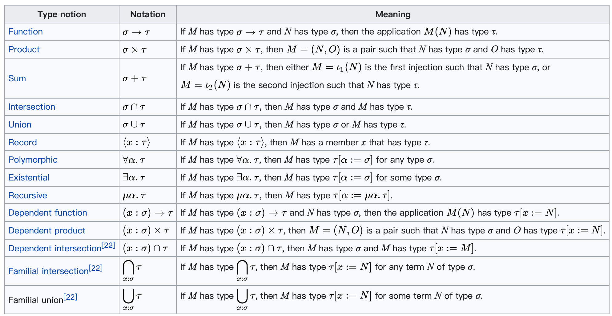

# 类型系统

## 类型由来

从历史上看，数学，逻辑学，集合论，类型论。

Bertrand Russell（罗素）& [ZFC](https://en.wikipedia.org/wiki/Zermelo%E2%80%93Fraenkel_set_theory)

- 每个术语都应该被分配一个类型。它通常用冒号表示：
2 : nat

- 如果我们想定义一个函数，我们将定义它操作的类型：例如
times2 : nat → nat

> f: X → Y read as: f is a function from XX (domain) to YY (codomain).

- 可以使用明确定义的规则转换术语：例如
2 + 2 ↠ 4 和 2 + 2 = 4, 他们的类型是相同的

1940年，Alonzo Church将类型理论与他自己的`lambda`演算相结合，创建了[简单类型的lambda演算](https://en.wikipedia.org/wiki/Simply_typed_lambda_calculus)。从那时起，出现了更高级的类型理论。

## 类型直觉

类型论与集合论并行存在：

1. 我们说值a属于一个类型A：`(a : A)`
2. 我们也可以说值a属于一个集合A：`(a ∈ A).`
3. 我们也可以说类型A是类型B的父类型，类型B是类型C的父类型：`C ⊂ B ⊂ A`
4. 我们也可以说t同时属于类型X和Y：`t ∈ X ∩ Y`

如果我们定义了一组除自身之外的所有值，在类型理论中，我们将其称为顶级类型：包含所有其他类型（是其超类型）的类型。类似地，空集将有一个底部类型形式的对应物。为了更容易记住，将类型想象成一个层次结构，其中更通用（较少限制）的类型在上面，更具体（有更多要求）在下面。然后没有要求的类型将位于顶部并包含所有值，而底部的类型及其上方所有类型的要求（必须是矛盾的）将是空的

## In Programming Language

**类型系统其实就是，对类型进行定义、检查和处理的系统。**

作为一门语言的核心要素，类型系统很大程度上塑造了语言的用户体验以及程序的安全性。为什么这么说？因为，在机器码的世界中，没有类型而言，指令仅仅和立即数或者内存打交道，内存中存放的数据都是字节流。

所以，可以说类型系统完全是一种工具，编译器在编译时对数据做静态检查，或者语言在运行时对数据做动态检查的时候，来保证某个操作处理的数据是开发者期望的数据类型。

## In Scala

值a属于类型A

```scala
val a: A
def f(a: A): B
```

times2 : int → int

```scala
val times2: Int => Int
```

## 附

[Type theory](https://plato.stanford.edu/entries/type-theory/)

[Set Theory](https://plato.stanford.edu/entries/set-theory/)


